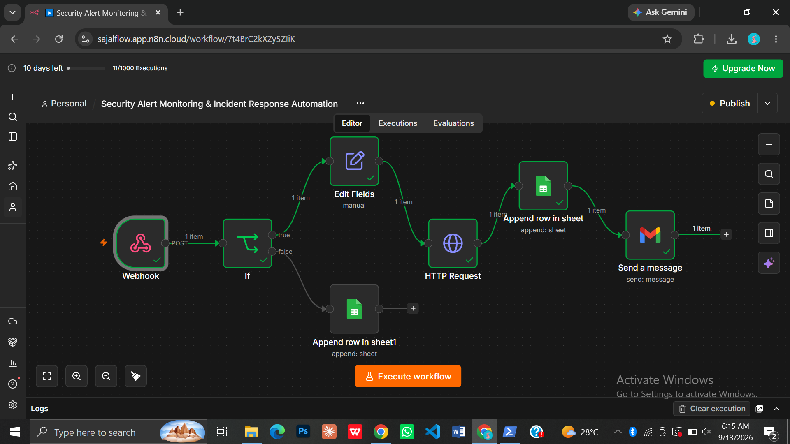
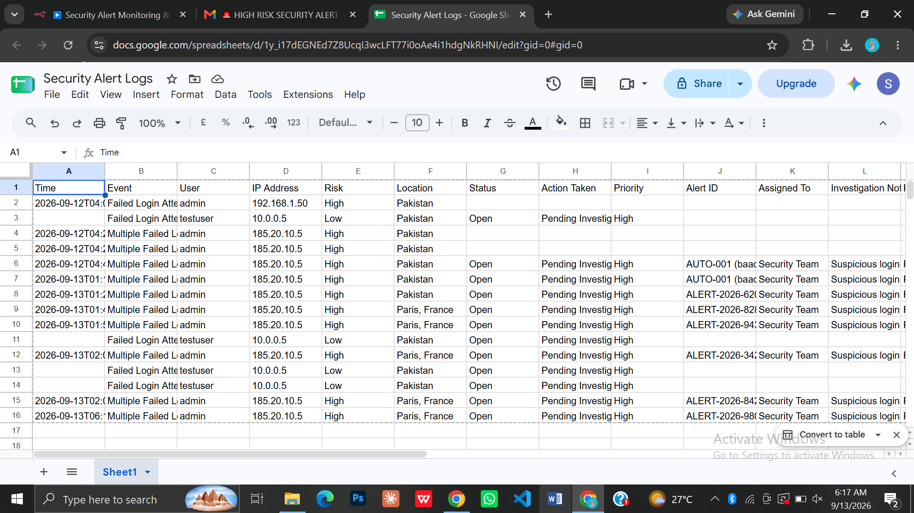
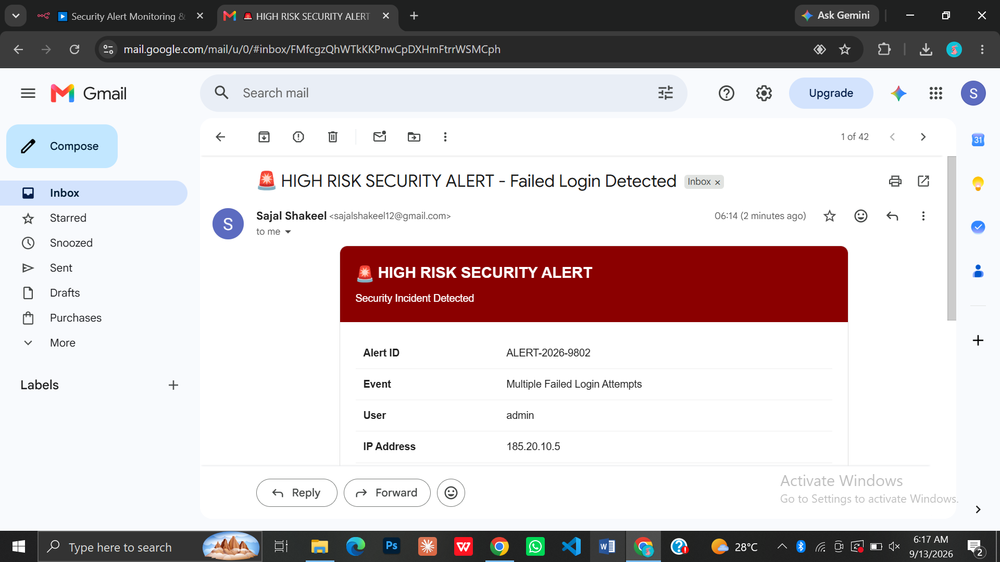

# n8n Security Alert Monitoring & Incident Response Automation

An automated security monitoring and incident response workflow built with n8n that receives security events through a webhook, classifies risk levels, retrieves IP-related information, records structured security incidents in Google Sheets, and sends automated Gmail alerts for high-risk security activities.

## Overview

This project demonstrates a practical security alert monitoring and incident response workflow using n8n.

The workflow receives security event data through a webhook and evaluates the event based on its risk level. The alert information is then prepared, additional IP-related information is retrieved, and the incident is recorded in Google Sheets.

For high-risk security events, the workflow also sends an automated Gmail notification to the designated security email.

The workflow provides two main paths:

- High-Risk Security Event
- Low-Risk Security Event

## Workflow

Webhook
↓
IF Condition
↓
├── High Risk → Edit Fields → HTTP Request → Google Sheets → Gmail Alert
│
└── Low Risk → Google Sheets Incident Log

## Key Features

- Automated security event monitoring
- Webhook-based security event collection
- Risk-based workflow classification
- Conditional processing using IF logic
- Security alert data preparation
- IP information lookup
- Automated incident logging
- Unique security Alert ID generation
- Incident status tracking
- Priority classification
- Investigation notes management
- Security team assignment tracking
- Automated high-risk email alerts
- Centralized security incident records
- JSON-based security event handling
- Workflow-based incident response

## Technologies Used

- n8n
- Webhook
- IF Condition
- Edit Fields
- HTTP Request / API
- Google Sheets
- Gmail
- JSON
- Conditional Logic
- Workflow Automation

## Workflow Structure

### 1. Webhook

The **Webhook** receives security event information from an external source.

The incoming event can contain details such as the event type, user, IP address, risk level, location, and Alert ID.

### 2. Risk Classification

The **IF Condition** evaluates the security event and determines the appropriate workflow path based on the configured risk level.

The workflow separates events into:

- High-Risk Security Events
- Low-Risk Security Events

### 3. Prepare Alert Data

The **Edit Fields** node prepares and structures the security alert information before it continues through the high-risk processing path.

A unique Alert ID and IP address information are also prepared for further processing.

### 4. IP Information Lookup

The **HTTP Request** node retrieves IP-related information such as location and country details.

This information is used to provide additional context for the security incident.

### 5. Google Sheets Incident Log

The security event is recorded in **Google Sheets** as a structured incident record.

The incident log can include:

- Time
- Event
- User
- IP Address
- Risk
- Location
- Status
- Action Taken
- Priority
- Alert ID
- Assigned To
- Investigation Notes
- Resolution

### 6. Gmail Security Alert

For high-risk security events, the workflow sends an automated Gmail notification to the designated security email.

The alert contains important information about the detected security incident and helps the recipient identify the event for further investigation.

### 7. Low-Risk Event Processing

Low-risk security events follow the appropriate processing path and are recorded in Google Sheets.

This allows security events to be maintained as structured incident records without triggering the high-risk email notification path.

## Project Files

- `workflow/` — Contains the exported n8n workflow JSON.
- `screenshots/` — Contains workflow execution, Google Sheets, and Gmail alert screenshots.
- `docs/` — Contains the project documentation.
- `README.md` — Project documentation.

## Screenshots

Project workflow and execution evidence are available in the `screenshots/` folder.

The screenshots include:

- n8n workflow execution
- Google Sheets security incident log
- High-risk Gmail security alert

## How to Use

1. Import the workflow JSON file into n8n.
2. Configure the webhook settings.
3. Configure your Google Sheets credentials.
4. Configure your Gmail credentials.
5. Review the risk classification condition.
6. Review the IP information lookup configuration.
7. Submit a test security event through the webhook.
8. Verify the incident record in Google Sheets.
9. Verify the high-risk alert in Gmail.
10. Test the low-risk workflow path.
11. Activate the workflow after successful testing.

## Testing

The workflow was tested using both high-risk and low-risk security events.

### High-Risk Security Alert Test

A high-risk security event was submitted through the webhook.

The workflow successfully:

- Processed the security event
- Retrieved IP-related information
- Recorded the incident in Google Sheets
- Sent a high-risk security alert through Gmail

### Low-Risk Security Alert Test

A low-risk security event was submitted through the webhook.

The workflow successfully:

- Processed the low-risk event
- Recorded the event through the appropriate Google Sheets path
- Verified the low-risk workflow behavior

## Incident Monitoring

The Google Sheets incident log provides a structured record of security events.

Each record can contain the event details, risk level, status, priority, assigned team, investigation notes, and resolution status.

This provides a centralized location for reviewing and tracking security incidents.

## Alert Notification

High-risk events generate an automated Gmail security alert.

The notification includes relevant incident information such as:

- Alert ID
- Event
- User
- IP Address
- Risk Level
- Location
- Status
- Action Taken
- Priority
- Assigned To
- Investigation Notes

## Skills Demonstrated

- Workflow Automation
- Webhook Integration
- Conditional Logic
- HTTP/API Integration
- JSON Data Handling
- Security Event Monitoring
- Risk Classification
- Incident Logging
- Email Automation
- Google Sheets Integration
- n8n Workflow Development
- Basic Incident Response Concepts

## Project Information

**Project Name:** n8n Security Alert Monitoring & Incident Response Automation

**Category:** Security Automation / Incident Response

**Automation Platform:** n8n

**Data Storage:** Google Sheets

**Notification Service:** Gmail

**Data Format:** JSON

## Future Enhancements

The workflow can be extended with additional security automation capabilities, including:

- Advanced risk scoring
- Multiple notification channels
- Automated incident escalation
- Security monitoring dashboards
- Additional threat intelligence integrations
- Automated response actions
- Advanced incident analytics
- Additional security event sources

## Notes

This project was developed as a practical automation project to demonstrate security event monitoring, risk classification, incident logging, API integration, and automated notifications using n8n.

## Workflow

## Google Sheets Incident Log

## Gmail Security Alert

